<div align="center">


<a href="https://github.com/mlinarik">
  
</a>

<br/>


</div>

---

## About

I lead the charge in building, scaling, and optimizing **Application Security** programs that protect enterprise applications from code to cloud. With experience spanning **SAST, DAST, SCA, CWPP, WAF**, and **AI-driven security initiatives**, I partner with developers, architects, and leadership to weave security seamlessly into modern development lifecycles.

> Security should be an enabler, not a blocker. My mission is to make secure development the easiest path forward.

---

## What I Do

<table>
<tr>
<td width="50%" valign="top">

**Secure the SDLC**
Embedding security from ideation through deployment.

**AppSec Strategy**
Aligning security controls with business objectives.

**Tooling Leadership**
Scaling platforms like Checkmarx, Snyk, Veracode, NexusIQ, and Prisma Cloud.

</td>
<td width="50%" valign="top">

**Developer Empowerment**
Driving adoption via IDE plugins, CI/CD integration, and gamification.

**Risk Reduction**
Using AI, automation, and analytics to mitigate vulnerabilities faster.

**AI Security**
Securing LLM and ML systems, and applying AI to accelerate threat detection.

**Shift-Left Culture**
Championing security ownership across every team.

</td>
</tr>
</table>

---

## Technical Arsenal

<div align="center">

**Security &amp; AppSec**


**DevSecOps &amp; Cloud**


</div>

| Domain | Skills &amp; Tools |
|--------|----------------|
| **Application Security** | SAST, DAST, SCA, RASP, IAST |
| **DevSecOps** | GitHub Actions, Azure DevOps, Kubernetes Security |
| **Cloud Security** | AWS, Azure, Container Security |
| **Programming &amp; Scripting** | Python, Bash, PowerShell |
| **AI in Security** | ML-based risk scoring, LLM security research |

---

## Current Focus

```text
▸ AI-enhanced vulnerability detection
▸ Frictionless developer security experiences
▸ Cross-team collaboration for secure delivery
▸ A pervasive shift-left security culture
```

---

## By the Numbers

<div align="center">


&nbsp;&nbsp;


</div>

---

## GitHub Stats

<div align="center">


<br/>


</div>

---

<div align="center">


</div>
